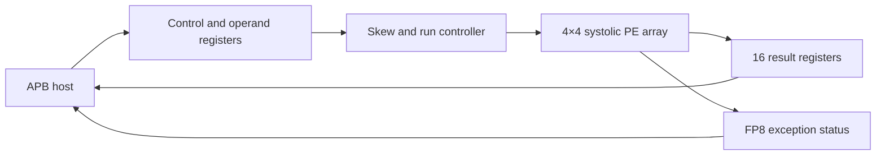
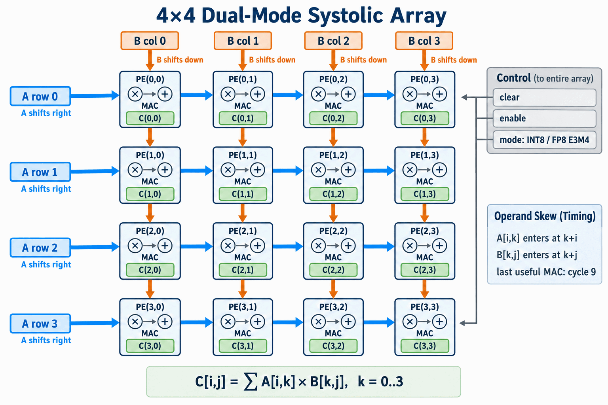
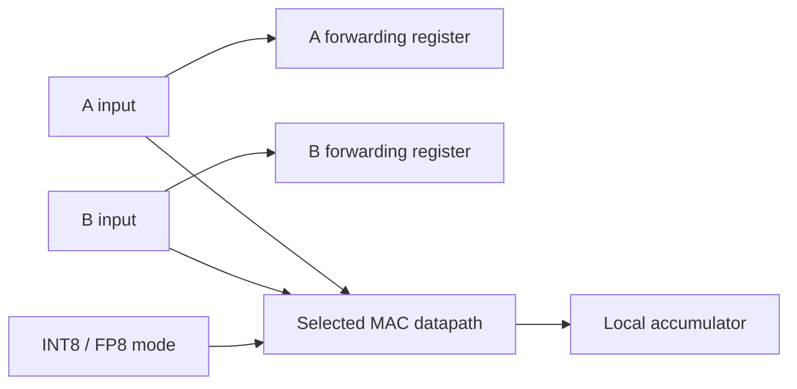
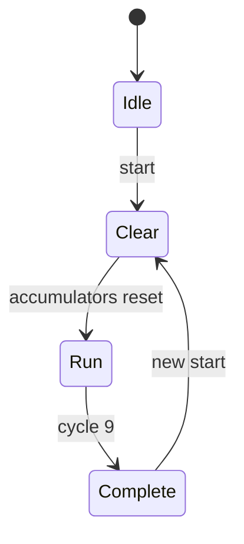

# Dual-Mode 4×4 Systolic Matrix Accelerator

A synthesizable SystemVerilog matrix-multiplication accelerator built around a 4×4 systolic processing-element array. The accelerator supports signed INT8 and FP8 E3M4 operation, exposes its operands, controls, status, and results through an APB3-style slave interface, and includes self-checking arithmetic and end-to-end architectural simulations.

This repository is a cleaned and corrected presentation of an academic systolic-multiplier project. It focuses on the actual implemented 4×4 architecture, removes private and institutional material, and separates historical synthesis evidence from claims about the refactored RTL.

## Design highlights

- 16 multiply-accumulate processing elements arranged as a 4×4 mesh
- Systolic movement of matrix-A values from left to right
- Systolic movement of matrix-B values from top to bottom
- Runtime-selectable signed INT8 or FP8 E3M4 computation
- 32-bit signed accumulation in INT8 mode
- FP8 multiply and accumulate with subnormals, infinities, NaNs, round-to-nearest-even, and sticky exception status
- APB-accessible operand banks, control/status registers, and result bank
- Deterministic input skewing and ten active systolic cycles per 4×4 operation
- Portable VCD waveforms and automated Icarus Verilog regression tests
- Sanitized Design Compiler script plus carefully qualified historical PPA data

## System architecture



The APB wrapper stores 16 eight-bit elements for each input matrix. A start command latches the selected arithmetic mode, clears the processing elements, and launches the core. Results remain readable until the next operation.

## Systolic dataflow



**Figure — 4×4 systolic-array datapath.** Matrix-A elements enter at the left edge and move horizontally along the blue paths; matrix-B elements enter at the top edge and move vertically along the orange paths. Each `PE(i,j)` registers and forwards both operands while multiplying the pair that meets locally and accumulating it into output element `C(i,j)`. The same physical mesh executes either signed INT8 or FP8 E3M4 arithmetic, selected once for the complete operation.

For output element `C[i,j]`, the PE computes:

```text
C[i,j] = Σ A[i,k] × B[k,j],  k = 0..3
```

There are **no diagonal data connections** in the mesh. The controller instead creates a diagonal *wavefront in time* by staggering the edge inputs: it injects `A[i,k]` at cycle `k+i` and `B[k,j]` at cycle `k+j`. After strictly horizontal and vertical propagation, both operands meet at `PE(i,j)` during cycle `k+i+j`. Zero-valued padding fills unused edge slots. For a 4×4 multiplication, the final useful pair (`k = 3`) reaches the farthest processing element, `PE(3,3)`, at cycle `3+3+3 = 9`; the controller then captures all 16 accumulated results.

## Processing element



Both operand forwarding and accumulation occur on the rising clock edge while the array is enabled.

### INT8 mode

Operands are interpreted as signed two's-complement eight-bit integers. Each PE forms a signed 8×8 product and accumulates into a 32-bit signed register. The wider accumulator avoids the eight-bit wraparound present in the archived lab version.

### FP8 E3M4 mode

An FP8 value is encoded as:

| Field | Bits | Meaning |
| --- | ---: | --- |
| Sign | 1 | Positive or negative |
| Exponent | 3 | Bias = 3 |
| Fraction | 4 | Four stored fraction bits |

| Category | Encoding | Value behavior |
| --- | --- | --- |
| Zero | `s_000_0000` | Signed zero |
| Subnormal | `s_000_ffff` | `(-1)^s × (ffff/16) × 2^-2` |
| Normal | exponent `001`–`110` | `(-1)^s × (1+ffff/16) × 2^(exp-3)` |
| Infinity | `s_111_0000` | Signed infinity |
| NaN | `s_111_ffff`, `ffff ≠ 0` | Not-a-number |

The smallest positive subnormal is 0.015625 (`0x01`), the smallest normal is 0.25 (`0x10`), and the largest finite value is 15.5 (`0x6F`). Arithmetic uses round-to-nearest-even. Each PE accumulates in FP8, so rounding occurs after every multiply and add rather than only once after the dot product.

The four sticky status bits are `{invalid, overflow, underflow, inexact}`. They are OR-reduced across all PEs and exposed through the APB status register.

## Controller sequence



- `Idle`: waits for the first start command.
- `Clear`: clears accumulators and systolic forwarding registers.
- `Run`: injects skewed operands for cycles 0 through 9.
- `Complete`: holds the result matrix and asserts `done` until another start.

## APB register map

The slave uses a 12-bit byte address and 32-bit data. Transfers complete without wait states (`PREADY = 1`). Operand and result elements occupy individual word-aligned addresses; only the low byte is used for A and B.

| Address | Name | Access | Description |
| ---: | --- | --- | --- |
| `0x000` | Control | W | Bit 0 starts an operation when not busy |
| `0x004` | Status | R | Bit 0 busy, bit 1 done, bit 2 any FP8 exception, bits 6:3 detailed status |
| `0x008` | Mode | R/W | `0` signed INT8, `1` FP8 E3M4 |
| `0x00C` | Information | R | `{result_width, operand_width, rows, columns}` = `0x20080404` |
| `0x100`–`0x13C` | Matrix A | R/W | 16 row-major eight-bit elements |
| `0x140`–`0x17C` | Matrix B | R/W | 16 row-major eight-bit elements |
| `0x180`–`0x1BC` | Matrix C | R | 16 row-major 32-bit results |

Misaligned, unsupported, or write-protected transfers assert `PSLVERR`. Mode and operand writes are rejected while the accelerator is busy.

## Repository files

| File | Contribution to the design |
| --- | --- |
| [`rtl/fp8_e3m4_mul.sv`](rtl/fp8_e3m4_mul.sv) | FP8 multiplier, special-case handling, normalization, subnormal generation, RNE rounding, and status flags |
| [`rtl/fp8_e3m4_add.sv`](rtl/fp8_e3m4_add.sv) | FP8 add/subtract using an exact `2^-6` internal scale, magnitude normalization, RNE rounding, and status flags |
| [`rtl/dual_mode_mac_pe.sv`](rtl/dual_mode_mac_pe.sv) | One dual-mode PE with registered operand forwarding, INT8/FP8 accumulators, and sticky FP8 status |
| [`rtl/systolic_array_4x4.sv`](rtl/systolic_array_4x4.sv) | Structural 16-PE mesh and flattened result/status interfaces |
| [`rtl/matrix_accelerator_core.sv`](rtl/matrix_accelerator_core.sv) | Operation state machine, mode latching, input skew schedule, completion timing, and status reduction |
| [`rtl/matmul_apb_wrapper.sv`](rtl/matmul_apb_wrapper.sv) | APB decoding, operand storage, readback, access protection, and core integration |
| [`tb/fp8_arithmetic_tb.sv`](tb/fp8_arithmetic_tb.sv) | Directed FP8 checks covering normal, subnormal, tie-to-even, NaN, infinity, overflow, and underflow cases |
| [`tb/matmul_apb_tb.sv`](tb/matmul_apb_tb.sv) | End-to-end APB, signed INT8 matrix, FP8 matrix, status, and 32-element result checking |
| [`synthesis/compile_dc.tcl`](synthesis/compile_dc.tcl) | Sanitized synthesis flow for the complete cleaned APB accelerator |
| [`docs/synthesis-summary.md`](docs/synthesis-summary.md) | Aggregate historical INT8/FP8 synthesis evidence and interpretation limits |
| [`.github/workflows/rtl-simulation.yml`](.github/workflows/rtl-simulation.yml) | Automatic arithmetic and accelerator regressions on pushes and pull requests |

## Verification

Run the two regressions with Icarus Verilog:

```bash
iverilog -g2012 -s fp8_arithmetic_tb \
  -o fp8_arithmetic.vvp rtl/*.sv tb/fp8_arithmetic_tb.sv
vvp fp8_arithmetic.vvp

iverilog -g2012 -s matmul_apb_tb \
  -o matmul_apb.vvp rtl/*.sv tb/matmul_apb_tb.sv
vvp matmul_apb.vvp
```

The arithmetic test includes exact normal/subnormal operations, a halfway case that rounds to even, invalid infinity-times-zero, opposite infinities, underflow, and overflow. The architectural test performs APB configuration and checks:

- A signed INT8 multiplication with positive and negative operands
- All 16 signed 32-bit INT8 result elements
- A complete FP8 multiplication where two all-ones matrices produce 4.0 (`0x50`) in every result PE
- All 16 FP8 result elements and aggregated exception status
- Busy-to-done sequencing and the accelerator information register

Both tests generate portable VCD files and run automatically through GitHub Actions.

## Historical synthesis results

The archive contained Design Compiler reports for separate INT8 and FP8 compute engines using the OSU FreePDK 45 nm library. The useful aggregate values are preserved below; see [`docs/synthesis-summary.md`](docs/synthesis-summary.md) for methodology and interpretation limits.

| Metric | Archived INT8 | Archived FP8 E3M4 |
| --- | ---: | ---: |
| Effective timing constraint | 1.00 ns | 2.00 ns |
| Setup slack | 0.00 ns (MET) | 0.00 ns (MET) |
| Total cells | 7,019 | 13,399 |
| Total cell area | 24,790.303 µm² | 36,261.872 µm² |
| Dynamic-power estimate | 18.4181 mW | 8.8201 mW |
| Leakage-power estimate | 120.9500 µW | 167.7365 µW |

These reports describe the archived, separate-mode RTL—not this refactored runtime-selectable APB accelerator. The original INT8 Tcl intended 600 MHz but used integer division and actually constrained the design to 1.00 ns. Neither report establishes maximum frequency, post-layout timing, or measured silicon power.

## Synthesis

The sanitized script targets the complete APB wrapper with a 2.0 ns example clock constraint:

```bash
export PDK_DIR=/path/to/library-directory
cd synthesis
dc_shell -f compile_dc.tcl
```

Change the target library and constraints to match the intended ASIC or FPGA flow. Fresh synthesis is required before quoting PPA for this version.

## Refactoring and scope decisions

The archive was not published verbatim. The cleaned design:

- Replaces absolute home-directory memory paths with APB-loaded operand registers.
- Replaces disabled RAM writes and hierarchy-based testbench initialization with legal APB transactions.
- Removes VCS, Verdi, FSDB, license-server, editor-swap, backup, raw log, and instance-listing files.
- Resolves inconsistent 16/32-bit APB declarations and provides explicit error signaling.
- Standardizes the floating-point name as FP8 E3M4; the report's isolated E4M3 label did not match the implemented encoding.
- Adds self-checking failures instead of waveform-only inspection.
- Uses 32-bit signed INT8 accumulation instead of reduced eight-bit wraparound.
- Implements runtime INT8/FP8 mode selection in the tested APB design.

The report sketches an extra-credit 8×8 arrangement made from four 4×4 blocks, but the archive does not contain a complete 8×8 top-level interconnect or a corresponding self-checking result test. This repository therefore does not claim an implemented 8×8 accelerator.

## Limitations

- Matrix dimensions are fixed at 4×4.
- FP8 accumulation rounds after each arithmetic operation; it is not a fused or wider-precision dot product.
- APB operand storage is implemented as registers, not inferred SRAM macros.
- The APB interface is single-clock and always-ready; clock-domain crossing is outside scope.
- No saturation mode is implemented for INT8 results because accumulation is widened to 32 bits.
- The FP8 implementation follows the documented E3M4 behavior but is not a formally verified implementation of an industry-standard FP8 interchange format.
